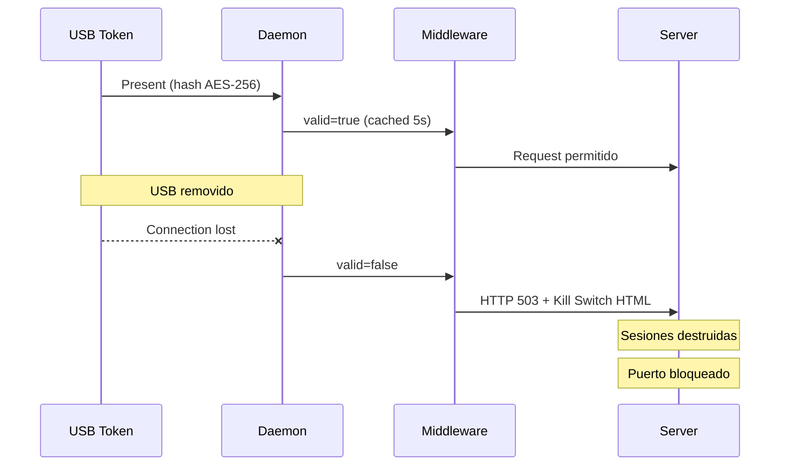
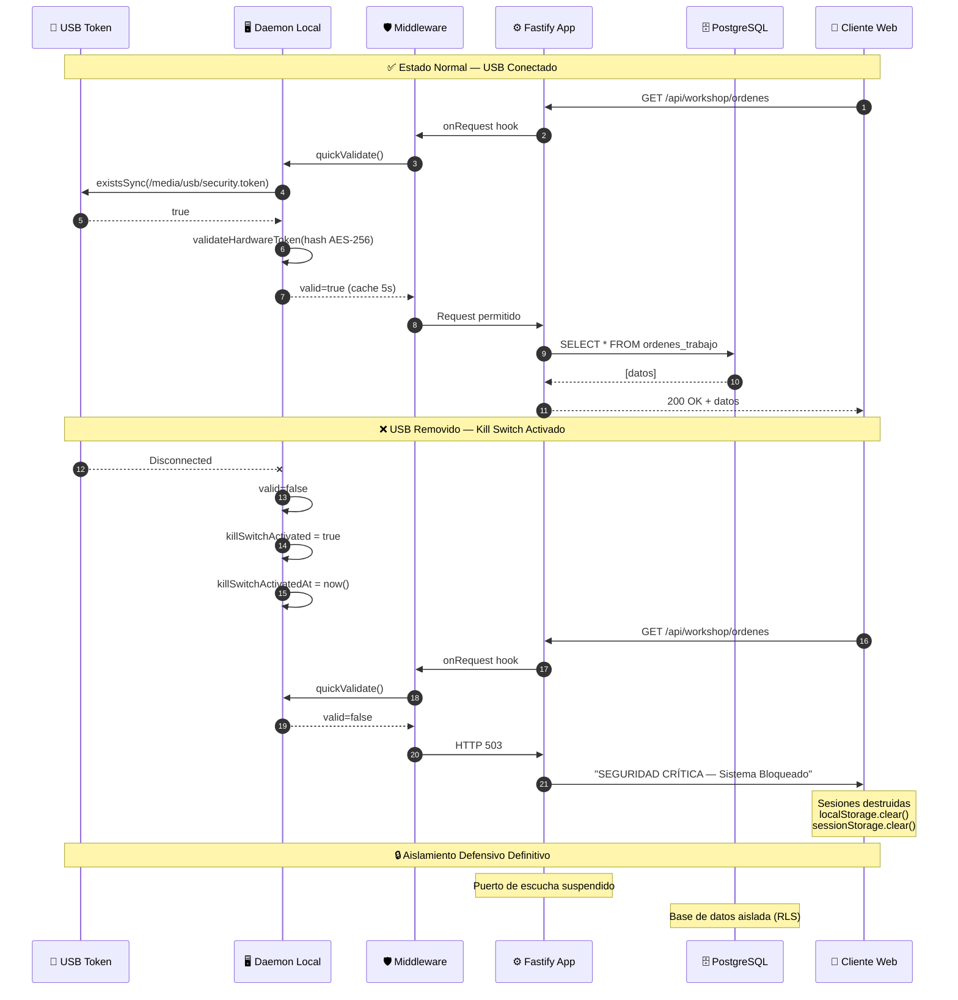
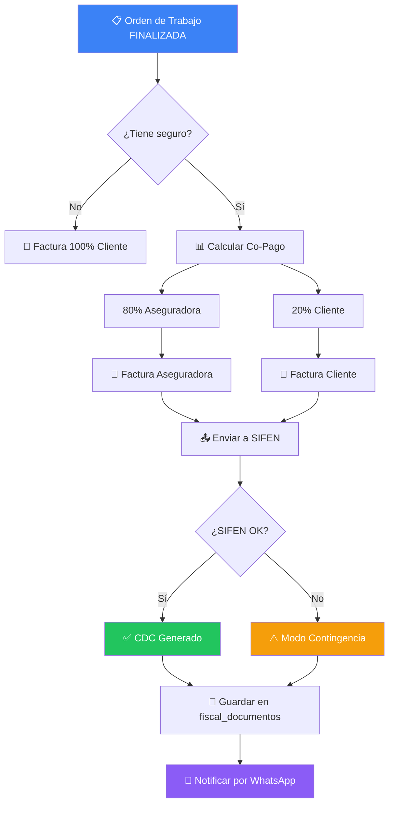

# Obsidian Vault — Guía de Configuración y Despliegue

**AutomotiveOS Cloud ERP — Knowledge Graph Architecture**

| Campo | Detalle |
|:---|:---|
| **Proyecto** | AutomotiveOS Cloud ERP |
| **Versión del Vault** | v1.0 |
| **Fecha** | Junio 2026 |
| **Objetivo** | Grafo de conocimiento interconectado para el equipo de ingeniería |
| **Autor** | Arquitecto de Gestión del Conocimiento |

---

## ÍNDICE

1. [Arquitectura de Carpetas](#1-arquitectura-de-carpetas)
2. [Sistema de Metadatos (YAML Properties)](#2-sistema-de-metadatos-yaml-properties)
3. [Estrategia de Enlaces y MOCs](#3-estrategia-de-enlaces-y-mocs)
4. [Configuración de Plugins](#4-configuración-de-plugins)
5. [Guía de Migración](#5-guía-de-migración)

---

## 1. ARQUITECTURA DE CARPETAS

### 1.1 Estructura Completa

```
AutomotiveOS_Vault/
├── 000_Meta_&_Templates/
│   ├── Templates/
│   │   ├── _Plantilla_Modulo_Endpoint.md
│   │   ├── _Plantilla_Bug_Report.md
│   │   ├── _Plantilla_Flujo_Trabajo.md
│   │   ├── _Plantilla_Sprint.md
│   │   ├── _Plantilla_Decision_Arquitectonica.md
│   │   └── _Plantilla_Integracion.md
│   ├── Attachments/
│   │   ├── images/
│   │   ├── diagrams/
│   │   └── screenshots/
│   ├── Scripts/
│   │   ├── dataview-queries.md
│   │   └── export-vault.sh
│   └── _📐_Graph_View_Config.md
│
├── 100_Planificacion_&_Alcance/
│   ├── Roadmap/
│   │   ├── 🗺️_Roadmap_Fase_1_Fundamentos.md
│   │   ├── 🗺️_Roadmap_Fase_2_Features.md
│   │   └── 🗺️_Roadmap_Fase_3_Produccion.md
│   ├── Historias_Usuario/
│   │   ├── HU-001_Gestion_Inventario.md
│   │   ├── HU-002_Facturacion_SIFEN.md
│   │   ├── HU-003_Agendamiento_Turnos.md
│   │   └── ...
│   ├── Especificaciones_ERS/
│   │   ├── ERS_01_Requisitos_Software.md
│   │   └── ...
│   ├── Actas/
│   │   ├── Acta_Sprint_54.md
│   │   ├── Acta_Sprint_55.md
│   │   └── ...
│   └── [[MOC_Planificacion]]
│
├── 200_Arquitectura_&_Core/
│   ├── Documentos/
│   │   ├── 📐_DAS_Documento_Arquitectura_Software.md
│   │   └── 📐_Decisiones_Arquitectonicas_ADR.md
│   ├── Base_Datos/
│   │   ├── 🗄️_Schema_Principal.md
│   │   ├── 🗄️_Diagrama_ERD.md
│   │   ├── 🗄️_Migraciones.md
│   │   └── 🗄️_RLS_Policies.md
│   ├── API/
│   │   ├── 🔌_Endpoints_Taller.md
│   │   ├── 🔌_Endpoints_Facturacion.md
│   │   ├── 🔌_Endpoints_Scheduling.md
│   │   ├── 🔌_Endpoints_CRM.md
│   │   └── 🔌_Endpoints_Seguridad.md
│   ├── Backend/
│   │   ├── ⚙️_Fastify_Plugins.md
│   │   ├── ⚙️_Middleware_Stack.md
│   │   ├── ⚙️_Tenant_Isolation.md
│   │   └── ⚙️_RBAC_Roles.md
│   ├── Frontend/
│   │   ├── 🖥️_Dashboard_Roles.md
│   │   ├── 🖥️_Modulos_Javascript.md
│   │   └── 🖥️_PWA_Offline_First.md
│   └── [[MOC_Desarrollo_Core]]
│
├── 300_Integraciones_&_Hardware/
│   ├── SIFEN/
│   │   ├── 🧾_SIFEN_Especificacion_DNIT.md
│   │   ├── 🧾_SIFEN_Flujo_DTE.md
│   │   ├── 🧾_SIFEN_Contingencia.md
│   │   ├── 🧾_SIFEN_Notas_Credito.md
│   │   └── [[MOC_Cumplimiento_Fiscal_SIFEN]]
│   ├── WhatsApp/
│   │   ├── 📱_Evolution_API_Config.md
│   │   ├── 📱_WhatsApp_Templates.md
│   │   ├── 📱_Flujo_Recordatorios.md
│   │   └── 📱_Rate_Limiting.md
│   ├── Twenty_CRM/
│   │   ├── 🤝_Twenty_CRM_Integration.md
│   │   ├── 🤝_Sync_ERP_to_CRM.md
│   │   └── 🤝_Idempotency_Keys.md
│   ├── Thinkcar/
│   │   ├── 🔧_Thinkcar_Mini_OBD2.md
│   │   ├── 🔧_Protocolo_Bluetooth.md
│   │   ├── 🔧_DTC_Database.md
│   │   └── 🔧_Thinkcar_USB_Email.md
│   └── [[MOC_Integraciones]]
│
├── 400_Seguridad_&_Infraestructura/
│   ├── Hardware/
│   │   ├── 🛡️_USB_Kill_Switch_Logica.md
│   │   ├── 🛡️_Hardware_Fingerprint.md
│   │   ├── 🛡️_AES256_Encryption.md
│   │   └── [[MOC_Seguridad_Hardware]]
│   ├── Infraestructura/
│   │   ├── 🐳_Docker_Compose.md
│   │   ├── 🐳_Docker_Resources.md
│   │   ├── 🐳_Redis_Auth.md
│   │   └── 🐳_Environment_Vars.md
│   ├── Auditoria/
│   │   ├── 📋_Security_Audit_2026.md
│   │   ├── 📋_CAPA_1_Seguridad.md
│   │   ├── 📋_CAPA_2_Concurrencia.md
│   │   ├── 📋_CAPA_3_Financiera.md
│   │   ├── 📋_CAPA_4_Infraestructura.md
│   │   └── 📋_CAPA_5_Frontend.md
│   ├── Backups/
│   │   ├── 💾_Politica_Backups.md
│   │   ├── 💾_Restore_Procedure.md
│   │   └── 💾_Backup_Integrity.md
│   └── [[MOC_Seguridad]]
│
├── 500_Manuales_&_Operaciones/
│   ├── Guias_Usuario/
│   │   ├── 👨‍🔧_Guia_Mecanico.md
│   │   ├── 💰_Guia_Cajero.md
│   │   ├── 👨‍💼_Guia_Administrador.md
│   │   └── 📋_Guia_Asistencia_Servicio.md
│   ├── Flujos/
│   │   ├── 🔄_Flujo_Completo_Taller.md
│   │   ├── 🔄_Flujo_Facturacion_Mixta.md
│   │   ├── 🔄_Flujo_Agendamiento.md
│   │   ├── 🔄_Flujo_CheckIn_OT.md
│   │   └── 🔄_Flujo_WhatsApp_Recordatorio.md
│   └── [[MOC_Manuales]]
│
├── 600_QA_Calidad_&_Auditorias/
│   ├── Reportes/
│   │   ├── 📊_Reporte_Calidad_v2.md
│   │   ├── 📊_Smoke_Test_E2E.md
│   │   └── 📊_Pentesting_Matrix.md
│   ├── Pruebas/
│   │   ├── 🧪_Suite_1398_Tests.md
│   │   ├── 🧪_Backup_Integrity_Tests.md
│   │   └── 🧪_E2E_Lifecycle.md
│   ├── Sprints/
│   │   ├── 📅_Sprint_55_Security.md
│   │   ├── 📅_Sprint_56_CSP.md
│   │   ├── 📅_Sprint_57_Privacy.md
│   │   └── 📅_Sprint_58_Performance.md
│   ├── Kanban/
│   │   └── 📌_Kanban_Backlog.md
│   └── [[MOC_Suite_Pruebas_QA]]
│
├── _🎯_START_HERE_MOC.md
├── [[MOC_Planificacion]]
├── [[MOC_Desarrollo_Core]]
├── [[MOC_Cumplimiento_Fiscal_SIFEN]]
├── [[MOC_Seguridad_Hardware]]
├── [[MOC_Suite_Pruebas_QA]]
├── [[MOC_Integraciones]]
├── [[MOC_Manuales]]
└── [[MOC_Seguridad]]
```

### 1.2 Convenciones de Nomenclatura

| Prefijo | Significado | Ejemplo |
|:---|:---|:---|
| `🧭` | Documento de arquitectura / decisión | `📐_DAS_Documento_Arquitectura.md` |
| `🔌` | Endpoint de API | `🔌_Endpoints_Taller.md` |
| `🗄️` | Base de datos / Schema | `🗄️_Schema_Principal.md` |
| `🛡️` | Seguridad / Hardware | `🛡️_USB_Kill_Switch_Logica.md` |
| `🧾` | Fiscal / SIFEN | `🧾_SIFEN_Flujo_DTE.md` |
| `📱` | WhatsApp / Móvil | `📱_Evolution_API_Config.md` |
| `🔧` | Hardware / Thinkcar | `🔧_Thinkcar_Mini_OBD2.md` |
| `🔄` | Flujo de trabajo | `🔄_Flujo_Completo_Taller.md` |
| `🧪` | Test / Prueba | `🧪_Suite_1398_Tests.md` |
| `📅` | Sprint / Timeline | `📅_Sprint_55_Security.md` |
| `📌` | Kanban / Tarea | `📌_Kanban_Backlog.md` |
| `[[ ]]` | Enlace bidireccional | `[[MOC_Desarrollo_Core]]` |

---

## 2. SISTEMA DE METADATOS (YAML PROPERTIES)

### 2.1 Plantilla: Módulo de Software / Endpoint

```yaml
---
# ═══ IDENTIFICACIÓN ═══
id: MOD-001
titulo: "Módulo de Facturación SIFEN"
alias: "SIFEN, Facturación Electrónica, DTE"

# ═══ CLASIFICACIÓN ═══
tipo: modulo          # endpoint | modulo | servicio | middleware | schema | util
capa: backend         # backend | frontend | BD | infra | testing
dominio: fiscal       # taller | inventario | fiscal | scheduling | crm | seguridad | hardware | analytics
subdominio: "sifen-dnit"

# ═══ ESTADO ═══
estado: certificado    # propuesto | desarrollo | testing | certificado | bloqueado | deprecado
fase: 3               # 1 | 2 | 3
sprint: 55

# ═══ RESPONSABLES ═══
responsable: "[[jaraju01]]"
revisado_por: "[[oracle-arch]]"

# ═══ DEPENDENCIAS ═══
dependencias:
  - "[[MOD-002_Schema_Fiscal]]"
  - "[[MOD-003_Crypto_Services]]"
dependientes:         # Notas que dependen de ESTA nota
  - "[[END-015_Emitir_DTE]]"
  - "[[END-016_Consultar_DTE]]"

# ═══ ARCHIVOS ═══
archivos_fuente:
  - "src/modules/finance/routes/sifen.ts"
  - "src/modules/finance/services/sifen/sifen-xml.service.ts"
  - "src/modules/finance/services/sifen/sifen-xml-utils.ts"
documentacion:
  - "[[ERS_02_Facturacion_SIFEN]]"
  - "[[DAS_Section_4_Fiscal]]"

# ═══ MÉTRICAS ═══
tests: 44
coverage: 92
riesgo: bajo          # critico | alto | medio | bajo
prioridad: P0         # P0 | P1 | P2 | P3

# ═══ TEMPORAL ═══
fecha_creacion: 2026-04-01
fecha_certificacion: 2026-06-19
proxima_revision: 2026-07-01

# ═══ TAGS ═══
tags:
  - sifen
  - facturacion
  - fiscal
  - backend
  - bigint
  - certificado
---
```

### 2.2 Plantilla: Reporte de Error / Bug

```yaml
---
# ═══ IDENTIFICACIÓN ═══
id: BUG-001
titulo: "Float rounding en IVA 10% — SIFEN rechaza factura"
alias: "Bug IVA, Error Redondeo, SIFEN Rechazo"

# ═══ CLASIFICACIÓN ═══
tipo: bug
severidad: critica    # critica | alta | media | baja
categoria: matematica # matematica | seguridad | rendimiento | ui | logica | integracion
reproducibilidad: siempre  # siempre | intermitente | rara_vez

# ═══ ESTADO ═══
estado_ticket: resuelto    # abierto | en_progreso | resuelto | verificado | cerrado | wont_fix
resuelto_en_sprint: 55
commit_fix: "47bcce7"

# ═══ MÓDULO AFECTADO ═══
modulo_afectado: "[[MOD-001_SIFEN]]"
archivo_afectado: "src/modules/finance/routes/sifen.ts:172"
lineas_afectadas: "170-181"

# ═══ DESCRIPCIÓN ═══
# Usar formato inline o referencia a nota
descripcion_resumen: "91 instancias de parseFloat en cálculos monetarios causan errores de redondeo en IVA"
vector_ataque: "Factura mixta con IVA 10% y 5% genera centavos incorrectos"

# ═══ IMPACTO ═══
impacto_fiscal: critico   # critico | alto | medio | bajo — multas SIFEN
impacto_usuario: alto     # critico | alto | medio | bajo
impacto_datos: medio      # critico | alto | medio | bajo

# ═══ SOLUCIÓN ═══
solucion_aplicada: "Reemplazo de parseFloat por BigInt (parseMoneyToCentavos/centavosToString)"
archivos_modificados:
  - "[[MOD-001_SIFEN]]"
  - "src/modules/finance/services/accounting/capa3-formatters.ts"
verificacion: "1398 tests passing, validación XML SIFEN V150"

# ═══ TEMPORAL ═══
fecha_deteccion: 2026-06-19
fecha_reporte: 2026-06-19
fecha_resolucion: 2026-06-19
dias_abierto: 0

# ═══ REPORTADO POR ═══
reportado_por: "Security Audit — CAPA 3"
asignado_a: "[[jaraju01]]"

# ═══ TAGS ═══
tags:
  - bug
  - critico
  - sifen
  - float
  - bigint
  - resuelto
---
```

### 2.3 Plantilla: Flujo de Trabajo / Manual

```yaml
---
# ═══ IDENTIFICACIÓN ═══
id: FLUJO-001
titulo: "Flujo Completo del Taller — Reservado a Facturado"
alias: "Flujo Taller, Lifecycle OT, Flujo Feliz"

# ═══ CLASIFICACIÓN ═══
tipo: flujo_trabajo
rol_usuario: todos     # mecanico | cajero | administrador | asesor | todos
sistema_critico: si    # si | no — afecta facturación o datos fiscales
modulos_involucrados:
  - "[[MOD-010_Scheduling]]"
  - "[[MOD-011_Workshop]]"
  - "[[MOD-001_SIFEN]]"
  - "[[MOD-015_WhatsApp]]"

# ═══ ESTADO ═══
estado: certificado
ultima_actualizacion: 2026-06-19
version: 2.0

# ═══ PASOS ═══
pasos_totales: 6
pasos_documentados: 6
tiempo_estimado: "45 minutos"

# ═══ EVIDENCIA ═══
test_asociado: "[[E2E_Smoke_Test]]"
commit_evidencia: "e7dc1bf"

# ═══ DOCUMENTACIÓN ═══
docs_oficiales:
  - "[[04_Manual_Usuario_y_Operaciones]]"
  - "[[ERS_Requisitos_Fase_2]]"

# ═══ TAGS ═══
tags:
  - flujo
  - taller
  - e2e
  - certificado
  - critico
---
```

### 2.4 Plantilla: Sprint

```yaml
---
# ═══ IDENTIFICACIÓN ═══
id: SPRINT-055
titulo: "Sprint 55 — Security Audit + P0-P2 Fixes"
alias: "Sprint 55, Security Hardening"

# ═══ CLASIFICACIÓN ═══
tipo: sprint
fase: 3
duracion_dias: 3

# ═══ ESTADO ═══
estado: completado     # planificacion | en_progreso | completado
porcentaje_avance: 100

# ═══ OBJETIVO ═══
objetivo: "Blindar el sistema contra hallazgos de seguridad del pentest"
criterios_exito:
  - "24 hallazgos mitigados"
  - "1387 tests passing"
  - "TOKEN_SECRET migrado a env var"

# ═══ ENTREGABLES ═══
entregables:
  - "[[MOD-001_SIFEN]] — BigInt IVA"
  - "[[MOD-020_Security_HW]] — resetKillSwitch auth"
  - "[[MOD-015_WhatsApp]] — Rate limiting"
  - "[[E2E_Smoke_Test]] — 6-step lifecycle"
  - "[[SECURITY_AUDIT_2026]] — 24 findings"

# ═══ MÉTRICAS ═══
tests_antes: 1343
tests_despues: 1387
tests_nuevos: 44
bugs_cerrados: 12
hallazgos_seguridad: 24

# ═══ BACKLOG ═══
backlog_siguiente:
  - "[[SPRINT-056]] — CSP + Idempotency + Backups"
  - "[[SPRINT-057]] — EXIF + Bluetooth + IndexedDB"
  - "[[SPRINT-058]] — Canvas throttling"

# ═══ TAGS ═══
tags:
  - sprint
  - seguridad
  - completado
---
```

---

## 3. ESTRATEGIA DE ENLACES Y MOCs

### 3.1 Convenciones de Enlaces

| Sintaxis | Uso | Ejemplo |
|:---|:---|:---|
| `[[Nombre]]` | Enlace a nota existente | `[[MOD-001_SIFEN]]` |
| `[[Nombre\|Alias]]` | Enlace con texto visible | `[[MOD-001_SIFEN\|Facturación]]` |
| `![[Nombre]]` | Incrustar contenido | `![[Diagrama_ERD]]` |
| `[[Nombre#Heading]]` | Enlace a sección | `[[DAS#3.2 Base de Datos]]` |
| `^block-ref` | Referencia a bloque | `^a1b2c3` |
| `{{template}}` | Insertar plantilla | `{{template:/_Plantilla_Modulo}}` |

### 3.2 Mapa de Contenido Central

Crear archivo: `_🎯_START_HERE_MOC.md`

```markdown
---
aliases: ["Inicio", "Home", "Dashboard del Vault"]
tags:
  - moc
  - central
cssclass: centrar-moc
---

# 🎯 AutomotiveOS — Knowledge Graph

> *El grafo de conocimiento del ERP Automotriz más completo de Paraguay.*

---

## 🗺️ Mapas de Contenido

### Desarrollo
| MOC | Descripción | Estado |
|:---|:---|:---|
| [[MOC_Desarrollo_Core]] | Arquitectura, Backend, BD, API | 🟢 Activo |
| [[MOC_Integraciones]] | SIFEN, WhatsApp, CRM, Thinkcar | 🟢 Activo |
| [[MOC_Seguridad]] | Kill-Switch, Encriptación, Auditorías | 🟢 Activo |

### Operaciones
| MOC | Descripción | Estado |
|:---|:---|:---|
| [[MOC_Planificacion]] | Roadmap, Historias de Usuario, Sprints | 🟢 Activo |
| [[MOC_Manuales]] | Guías de usuario y flujos de trabajo | 🟢 Activo |
| [[MOC_Suite_Pruebas_QA]] | QA, Pentesting, Smoke Test E2E | 🟢 Activo |

### Fiscal
| MOC | Descripción | Estado |
|:---|:---|:---|
| [[MOC_Cumplimiento_Fiscal_SIFEN]] | DNIT V150, IVA, CDC, Contingencia | 🟢 Activo |
| [[MOC_Seguridad_Hardware]] | USB Token, Fingerprint, AES-256 | 🟢 Activo |

---

## 📊 Dashboard Dataview

### Componentes en Desarrollo o Bloqueados
```dataview
TABLE estado AS "Estado", capa AS "Capa", sprint AS "Sprint", responsable AS "Responsable"
FROM "200_Arquitectura_&_Core"
WHERE tipo = "modulo" OR tipo = "endpoint"
WHERE estado = "desarrollo" OR estado = "bloqueado"
SORT estado ASC, prioridad ASC
```

### Últimos Bugs Críticos
```dataview
TABLE severidad AS "Severidad", modulo_afectado AS "Módulo", estado_ticket AS "Estado", fecha_deteccion AS "Detectado"
FROM "600_QA_Calidad_&_Auditorias"
WHERE tipo = "bug" AND severidad = "critica"
SORT fecha_deteccion DESC
LIMIT 10
```

### Sprints Completados
```dataview
TABLE fase AS "Fase", tests_despues AS "Tests", hallazgos_seguridad AS "Hallazgos"
FROM "600_QA_Calidad_&_Auditorias"
WHERE tipo = "sprint" AND estado = "completado"
SORT id DESC
LIMIT 5
```

---

## 🔗 Navegación Rápida

- **¿Eres nuevo?** → Empieza por [[MOC_Planificacion]]
- **¿Desarrollas código?** → Ve a [[MOC_Desarrollo_Core]]
- **¿Configuras hardware?** → Revisa [[MOC_Seguridad_Hardware]]
- **¿Facturas?** → Consulta [[MOC_Cumplimiento_Fiscal_SIFEN]]
- **¿Reportas bugs?** → Usa la plantilla `_Plantilla_Bug_Report`
- **¿Ejecutas pruebas?** → Revisa [[MOC_Suite_Pruebas_QA]]

---

## 📈 Métricas del Vault

```dataview
LIST length(rows) AS "Notas"
FROM ""
WHERE file.name != "_🎯_START_HERE_MOC"
GROUP BY file.folder
```
```

### 3.3 Sub-MOCs

#### `MOC_Desarrollo_Core.md`

```markdown
---
tags: [moc, arquitectura, backend, bd]
---

# 📐 MOC — Desarrollo Core

## Documentos de Arquitectura
- [[📐_DAS_Documento_Arquitectura_Software]]
- [[📐_Decisiones_Arquitectonicas_ADR]]

## Base de Datos
- [[🗄️_Schema_Principal]]
- [[🗄️_Diagrama_ERD]]
- [[🗄️_Migraciones]]
- [[🗄️_RLS_Policies]]

## API — Endpoints
- [[🔌_Endpoints_Taller]]
- [[🔌_Endpoints_Facturacion]]
- [[🔌_Endpoints_Scheduling]]
- [[🔌_Endpoints_CRM]]
- [[🔌_Endpoints_Seguridad]]

## Backend
- [[⚙️_Fastify_Plugins]]
- [[⚙️_Middleware_Stack]]
- [[⚙️_Tenant_Isolation]]
- [[⚙️_RBAC_Roles]]

## Frontend
- [[🖥️_Dashboard_Roles]]
- [[🖥️_Modulos_Javascript]]
- [[🖥️_PWA_Offline_First]]

## Métricas
```dataview
TABLE capa AS "Capa", estado AS "Estado", tests AS "Tests"
FROM "200_Arquitectura_&_Core"
WHERE tipo = "modulo" OR tipo = "endpoint"
SORT dominio ASC, estado ASC
```
```

#### `MOC_Cumplimiento_Fiscal_SIFEN.md`

```markdown
---
tags: [moc, sifen, fiscal, paraguay]
---

# 🧾 MOC — Cumplimiento Fiscal SIFEN

## Especificación DNIT
- [[🧾_SIFEN_Especificacion_DNIT]]
- [[🧾_SIFEN_Flujo_DTE]]
- [[🧾_SIFEN_Contingencia]]

## Documentos Tributarios
- [[🧾_SIFEN_Facturas_Electronicas]]
- [[🧾_SIFEN_Notas_Credito]]
- [[🧾_SIFEN_Notas_Debito]]

## Cálculos
- [[🧾_SIFEN_Calculo_IVA]]
- [[🧾_SIFEN_BigInt_Aritmetica]]
- [[🧾_SIFEN_Validacion_CDC]]

## Auditoría
- [[📋_CAPA_3_Financiera]]

## Dependencias
```dataview
TABLE dependencias AS "Depende de", estado AS "Estado"
FROM "300_Integraciones_&_Hardware/SIFEN"
SORT id ASC
```
```

#### `MOC_Seguridad_Hardware.md`

```markdown
---
tags: [moc, seguridad, hardware, usb]
---

# 🛡️ MOC — Seguridad Hardware

## USB Kill-Switch
- [[🛡️_USB_Kill_Switch_Logica]]
- [[🛡️_Hardware_Fingerprint]]
- [[🛡️_AES256_Encryption]]

## Auditoría de Seguridad
- [[📋_Security_Audit_2026]]
- [[📋_CAPA_1_Seguridad]]
- [[📋_CAPA_4_Infraestructura]]

## Infraestructura
- [[🐳_Docker_Compose]]
- [[🐳_Docker_Resources]]
- [[🐳_Redis_Auth]]

## Diagrama del Kill-Switch

```

#### `MOC_Suite_Pruebas_QA.md`

```markdown
---
tags: [moc, qa, testing, pentesting]
---

# 📊 MOC — Suite de Pruebas QA

## Reportes
- [[📊_Reporte_Calidad_v2]]
- [[📊_Smoke_Test_E2E]]
- [[📊_Pentesting_Matrix]]

## Pruebas
- [[🧪_Suite_1398_Tests]]
- [[🧪_Backup_Integrity_Tests]]
- [[🧪_E2E_Lifecycle]]

## Sprints de Calidad
- [[📅_Sprint_55_Security]]
- [[📅_Sprint_56_CSP]]
- [[📅_Sprint_57_Privacy]]
- [[📅_Sprint_58_Performance]]

## Métricas
```dataview
TABLE severidad AS "Severidad", estado_ticket AS "Estado", fecha_deteccion AS "Fecha"
FROM "600_QA_Calidad_&_Auditorias"
WHERE tipo = "bug"
SORT severidad ASC, fecha_deteccion DESC
```

## Kanban
```dataview
TABLE estado_ticket AS "Estado", severidad AS "Severidad"
FROM "600_QA_Calidad_&_Auditorias"
WHERE tipo = "bug"
GROUP BY estado_ticket
```
```

---

## 4. CONFIGURACIÓN DE PLUGINS

### 4.1 Dataview

**Instalar:** Community Plugins → buscar "Dataview" → Install

**Configuración en `app.json`:**

```json
{
  "dataview": {
    "enableDataviewJs": true,
    "enableInlineDataview": true,
    "enableInlineFieldQueries": true,
    "prettyRenderFields": true,
    "tableIdColumnName": "File",
    "tableGroupColumnName": "Group",
    "warnOnEmptyResult": true,
    "refreshEnabled": true,
    "refreshInterval": 2500
  }
}
```

**Consultas de Ejemplo:**

**DQL — Tabla de módulos bloqueados o en desarrollo:**

```dataview
TABLE
  tipo AS "Tipo",
  capa AS "Capa",
  estado AS "Estado",
  sprint AS "Sprint",
  responsable AS "Responsable",
  tests AS "Tests"
FROM "200_Arquitectura_&_Core"
WHERE tipo = "modulo" OR tipo = "endpoint"
WHERE estado = "desarrollo" OR estado = "bloqueado"
SORT estado ASC, prioridad ASC
```

**DQL — Últimos bugs críticos (SIFEN o Seguridad):**

```dataview
TABLE
  severidad AS "Severidad",
  modulo_afectado AS "Módulo",
  estado_ticket AS "Estado",
  fecha_deteccion AS "Detectado",
  resuelto_en_sprint AS "Sprint Fix"
FROM "600_QA_Calidad_&_Auditorias"
WHERE tipo = "bug"
WHERE severidad = "critica" OR severidad = "alta"
WHERE contains(file.tags, "#sifen") OR contains(file.tags, "#seguridad") OR contains(file.tags, "#usb")
SORT fecha_deteccion DESC
LIMIT 10
```

**Dataview JS — Dashboard de progreso de sprints:**

```dataviewjs
const sprints = dv.pages('"600_QA_Calidad_&_Auditorias"')
  .where(p => p.tipo === "sprint")
  .sort(p => p.id, 'desc')
  .limit(5);

dv.table(
  ["Sprint", "Estado", "Tests", "Hallazgos", "Avance"],
  sprints.map(p => [
    p.id,
    p.estado === "completado" ? "✅" : "🔄",
    p.tests_despues || "-",
    p.hallazgos_seguridad || "-",
    p.porcentaje_avance + "%"
  ])
);
```

**Dataview JS — Mapa de calor de severidad:**

```dataviewjs
const bugs = dv.pages('"600_QA_Calidad_&_Auditorias"')
  .where(p => p.tipo === "bug");

const counts = {
  critica: bugs.where(p => p.severidad === "critica").length,
  alta: bugs.where(p => p.severidad === "alta").length,
  media: bugs.where(p => p.severidad === "media").length,
  baja: bugs.where(p => p.severidad === "baja").length,
};

dv.paragraph(`
**Mapa de Calor de Bugs:**
- 🔴 Críticos: **${counts.critica}**
- 🟠 Altos: **${counts.alta}**
- 🟡 Medios: **${counts.media}**
- 🔵 Bajos: **${counts.baja}**
- **Total: ${bugs.length}**
`);
```

---

### 4.2 Obsidian Kanban

**Instalar:** Community Plugins → buscar "Kanban" → Install

**Crear tablero:** Nuevo archivo → `📌_Kanban_Backlog.md`

```markdown
---
tags:
  - kanban
  - backlog
kanban-plugin: basic
---

## 📌 Backlog — Fase 2

### 📋 Por Hacer
- [ ] Programar Canvas HTML5 para DVI
  - 📅 Sprint 59
  - 🏷️ #frontend #dvi
- [ ] Integrar Thinkcar Mini vía Bluetooth RFCOMM
  - 📅 Sprint 59
  - 🏷️ #hardware #thinkcar
- [ ] Agregar campo RUC al formulario de clientes
  - 📅 Sprint 60
  - 🏷️ #frontend #clientes

### 🔄 En Progreso
- [x] CSP estricto (Content Security Policy)
  - ✅ Completado Sprint 56
  - 📝 `security-headers.ts` actualizado
- [x] EXIF stripping en fotos DVI
  - ✅ Completado Sprint 57
  - 📝 `photo-storage.service.ts` con stripJpegExif()

### ✅ Certificado QA
- [x] Token Secret migrado a env var
  - ✅ Sprint 55
  - 🧪 1398 tests passing
- [x] Rate limiting WhatsApp (1.5s delay)
  - ✅ Sprint 55
  - 🧪 E2E Smoke Test PASSED
- [x] BigInt IVA para SIFEN
  - ✅ Sprint 55
  - 🧪 Validación DNIT V150 PASSED

### 🚀 Desplegado
- [x] Docker memory/CPU limits
  - ✅ Sprint 55
  - 🐳 docker-compose.yml actualizado
```

**Configuración del plugin Kanban:**

```json
{
  "kanban": {
    "new-note-folder": "600_QA_Calidad_&_Auditorias/Kanban",
    "new-note-template": "000_Meta_&_Templates/Templates/_Plantilla_Kanban_Card.md",
    "prepend-archive-separator": true,
    "prepend-archive-format": "YYYY-MM-DD"
  }
}
```

---

### 4.3 Excalidraw + Mermaid Integration

**Excalidraw — Diagrama del Kill-Switch:**

Crear nota: `🛡️_Diagrama_Kill_Switch_Visual.md`

```markdown
# Diagrama del Kill-Switch — Flujo de Seguridad



## Leyenda

| Símbolo | Significado |
|:---|:---|
| ✅ | Conexión estable, sistema operativo |
| ❌ | USB removido, kill switch activado |
| 🔒 | Modo aislamiento defensivo |
| ⏱️ 5s | Cache de validación (evita fs reads en cada request) |
| 🔐 AES-256-GCM | Algoritmo de cifrado del token |
```

**Mermaid — Diagrama de División de Factura Aseguradora:**

```markdown
# División de Factura — Co-Pago Aseguradora


```

---

### 4.4 Advanced Tables

**Instalar:** Community Plugins → buscar "Advanced Tables" → Install

**Atajos de Teclado Clave:**

| Atajo | Acción | Uso en el Proyecto |
|:---|:---|:---|
| `Tab` | Siguiente celda | Navegar matriz de vulnerabilidades |
| `Shift+Tab` | Celda anterior | Navegar hacia atrás |
| `Enter` | Nueva fila | Agregar nuevo hallazgo de seguridad |
| `Ctrl+Shift+D` | Insertar fila arriba | Insertar bug nuevo |
| `Ctrl+Shift+F` | Insertar fila abajo | Insertar debajo del actual |
| `Ctrl+E` | Editar celda | Modificar severidad |
| `Ctrl+Shift+C` | Formatear celda | Cambiar tipo de dato |

**Ejemplo de Matriz de Vulnerabilidades con Advanced Tables:**

```markdown
| ID | Vulnerabilidad | Riesgo | Estado | Sprint Fix |
|:---|:---|:---|:---|:---|
| SEC-01 | TOKEN_SECRET hardcoded | Crítico | Mitigado | Sprint 55 |
| SEC-02 | USB_PATH configurable | Crítico | Mitigado | Sprint 55 |
| SEC-03 | resetKillSwitch sin auth | Crítico | Mitigado | Sprint 55 |
| SEC-04 | Float rounding IVA | Crítico | Mitigado | Sprint 55 |
| SEC-05 | Race condition agendamiento | Crítico | Mitigado | Sprint 55 |
| SEC-06 | MIME spoofing DVI | Alto | Mitigado | Sprint 55 |
| SEC-07 | WhatsApp sin rate limit | Alto | Mitigado | Sprint 55 |
| SEC-08 | Docker sin limits | Alto | Mitigado | Sprint 55 |
| SEC-09 | CSP incompleto | Alto | Mitigado | Sprint 56 |
| SEC-10 | Sin idempotency CRM | Alto | Mitigado | Sprint 56 |
| SEC-11 | Sin test backups | Medio | Mitigado | Sprint 56 |
| SEC-12 | EXIF data exposición | Medio | Mitigado | Sprint 57 |
| SEC-13 | Bluetooth reconnect loop | Medio | Mitigado | Sprint 57 |
| SEC-14 | IndexedDB sin quota | Medio | Mitigado | Sprint 57 |
| SEC-15 | Canvas sin throttling | Bajo | Mitigado | Sprint 58 |
```

**Configuración de Advanced Tables:**

```json
{
  "advanced-tables": {
    "csv-delimiter": ",",
    "default-column-width": 150,
    "default-column": "text",
    "auto-align": true,
    "auto-format": true,
    "theme": ".obsidian"
  }
}
```

---

## 5. GUÍA DE MIGRACIÓN

### 5.1 Pasos para Crear el Vault

1. **Crear carpeta raíz:**
   ```bash
   mkdir AutomotiveOS_Vault
   cd AutomotiveOS_Vault
   ```

2. **Crear estructura de carpetas:**
   ```bash
   mkdir -p 000_Meta_\&_Templates/{Templates,Attachments/{images,diagrams,screenshots},Scripts}
   mkdir -p 100_Planificacion_\&_Alcance/{Roadmap,Historias_Usuario,Especificaciones_ERS,Actas}
   mkdir -p 200_Arquitectura_\&_Core/{Documentos,Base_Datos,API,Backend,Frontend}
   mkdir -p 300_Integraciones_\&_Hardware/{SIFEN,WhatsApp,Twenty_CRM,Thinkcar}
   mkdir -p 400_Seguridad_\&_Infraestructura/{Hardware,Infraestructura,Auditoria,Backups}
   mkdir -p 500_Manuales_\&_Operaciones/{Guias_Usuario,Flujos}
   mkdir -p 600_QA_Calidad_\&_Auditorias/{Reportes,Pruebas,Sprints,Kanban}
   ```

3. **Copiar plantillas YAML:**
   - Crear cada plantilla en `000_Meta_&_Templates/Templates/`
   - Pegar el bloque YAML de la sección 2

4. **Crear MOCs:**
   - Crear `_🎯_START_HERE_MOC.md` en la raíz
   - Crear cada sub-MOC en la carpeta correspondiente

5. **Instalar plugins:**
   - Dataview
   - Obsidian Kanban
   - Excalidraw
   - Advanced Tables

6. **Configurar Graph View:**
   - Abrir Graph View (`Ctrl+G`)
   - Configurar colores por carpeta:
     - `000_Meta` → Gris
     - `100_Planificacion` → Azul
     - `200_Arquitectura` → Verde
     - `300_Integraciones` → Naranja
     - `400_Seguridad` → Rojo
     - `500_Manuales` → Púrpura
     - `600_QA` → Amarillo

### 5.2 Migración de Documentos Existentes

Los documentos ya existentes en `docs/Proyecto/` pueden ser migrados así:

| Documento Actual | Nota en Vault | Carpeta |
|:---|:---|:---|
| `01_ERS_Especificacion_Requisitos_Software.md` | `ERS_01_Requisitos_Software.md` | `100_Planificacion_&_Alcance/Especificaciones_ERS/` |
| `02_DAS_Documento_Arquitectura_Software.md` | `📐_DAS_Documento_Arquitectura_Software.md` | `200_Arquitectura_&_Core/Documentos/` |
| `04_Manual_Usuario_y_Operaciones.md` | `🔄_Flujo_Completo_Taller.md` | `500_Manuales_&_Operaciones/Flujos/` |
| `05_Reporte_Calidad_Seguridad_y_Pruebas_QA.md` | `📊_Reporte_Calidad_v2.md` | `600_QA_Calidad_&_Auditorias/Reportes/` |
| `SECURITY_AUDIT_2026-06-19.md` | `📋_Security_Audit_2026.md` | `400_Seguridad_&_Infraestructura/Auditoria/` |

### 5.3 Scripts Útiles

**Script de exportación del vault:**

```bash
#!/bin/bash
# export-vault.sh — Exporta el vault a Markdown plano
VAULT_DIR="AutomotiveOS_Vault"
OUTPUT="AutomotiveOS_Vault_Export_$(date +%Y%m%d).md"

echo "# AutomotiveOS Vault Export — $(date)" > "$OUTPUT"
echo "" >> "$OUTPUT"

find "$VAULT_DIR" -name "*.md" -type f | sort | while read -r file; do
  echo "---" >> "$OUTPUT"
  echo "## $file" >> "$OUTPUT"
  echo "" >> "$OUTPUT"
  cat "$file" >> "$OUTPUT"
  echo "" >> "$OUTPUT"
done

echo "Exported to $OUTPUT"
```

---

## ANEXO: Referencia Rápida de YAML Properties

| Property | Tipo | Valores | Uso |
|:---|:---|:---|:---|
| `id` | string | `MOD-001`, `BUG-001`, `FLUJO-001` | Identificador único |
| `tipo` | enum | `endpoint`, `modulo`, `bug`, `flujo_trabajo`, `sprint` | Clasificación principal |
| `capa` | enum | `backend`, `frontend`, `BD`, `infra`, `testing` | Capa de arquitectura |
| `dominio` | enum | `taller`, `fiscal`, `scheduling`, `crm`, `seguridad` | Dominio funcional |
| `estado` | enum | `desarrollo`, `testing`, `certificado`, `bloqueado` | Estado actual |
| `severidad` | enum | `critica`, `alta`, `media`, `baja` | Impacto del bug |
| `fase` | number | `1`, `2`, `3` | Fase del proyecto |
| `sprint` | number | `55`, `56`, ... | Sprint asociado |
| `responsable` | link | `[[jaraju01]]` | Persona responsable |
| `dependencias` | list | `[[MOD-002]]` | Notas requeridas |
| `tags` | list | `#sifen`, `#seguridad` | Tags de Obsidian |
| `fecha_*` | date | `YYYY-MM-DD` | Fechas relevantes |

---

*Guía generada para AutomotiveOS Cloud ERP — Junio 2026*
*Vault version: v1.0*
